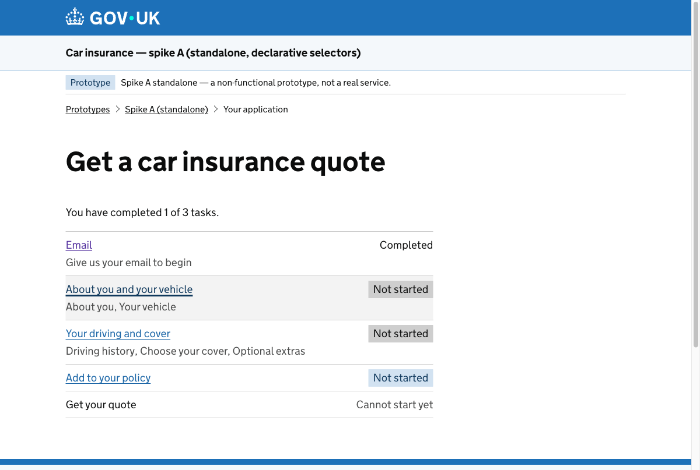

<!-- _class: title -->
<!-- _paginate: false -->

DEFRA show-and-tell · Live Animals frontend

# Two of us, one agent, four prototypes in a week

What agentic development let us actually do — not the hype, the receipts.

<!--
Speaker notes:
- Hi, I'm Sam. This is about a couple of weeks of frontend prototyping that Paul Hodgson and I did, working with an AI agent in a way that genuinely felt new.
- I'm not here to sell you AI. I'm going to show you a thing we did, give you the real numbers from git, and let you judge whether it's interesting.
- The one-line version: instead of arguing about the right design, we just built four of them — for real — so we could pick the best on evidence instead of opinion.
- Set the tone: this is a story with receipts. Everything on these slides is pulled straight from the repo.
-->

---

The job

## Model a GOV.UK journey as *data*, not code

A spike on the frontend: find the right way to represent a multi-step form journey as a **rendering-agnostic model** — *"portable data, not code"* that can answer *is this part complete? what's next? what's still required, and why?*

Deliberately a **throwaway** spike — built parallel to the real app, behind a feature flag, using a fictional **car-insurance** journey as a safe stand-in.

<!--
Speaker notes:
- The ticket was EUDPA-249. The question underneath it is one a lot of GDS teams have: our forms are long, branching, conditional journeys, and right now the "what page comes next / is this section done" logic is hand-written and scattered.
- The spike asked: could that live as plain declarative data — JSON or YAML, no code — so the same model could tell you what's next, what's complete, what's required and crucially *why*?
- Two deliberate choices that made us faster and more honest: (1) it's throwaway and non-functional, walled off from the real app behind a flag, so we could move fast without risk; (2) we used a car-insurance quote as the worked example precisely because it's NOT our animals/imports domain — it keeps everyone focused on the modelling problem, not the business rules.
-->

---

The usual way

## Normally, this stays an argument

A paradigm choice like this usually lives on a **whiteboard** — debated in the abstract, written up as options, decided on **opinion**.

Building more than one to compare is too expensive, so the alternatives stay hypothetical — and the **flaws stay hidden** until you've already committed to one.

<!--
Speaker notes:
- Here's the tension I want you to feel before the reveal. A decision like "how should we model a journey" is normally an architecture argument. Whiteboards, an options doc, maybe an RFC. People reason about which approach *would* be cleaner.
- And then you pick one — usually your favourite, or whoever argued hardest — and build it. The roads not taken stay as opinions. "A state machine would've been neater." Maybe! Nobody built it, so nobody knows.
- The catch: an idea on a whiteboard always sounds reasonable. You don't find out where it falls down until you've committed and you're knee-deep in it. The flaws are real, but they're invisible at the point you're choosing.
-->

---

What we did instead

# We didn't argue it on a whiteboard.
# We built all four.

Four genuinely different paradigms, behind one shared contract — real, clickable, tested, running side by side.

<!--
Speaker notes:
- So we didn't have the argument. We built all four. Four genuinely different ways of modelling the journey — not four flavours of one idea, properly different paradigms.
- The trick that makes them comparable: they all sit behind one shared contract — the same set of functions, "what steps apply, what's the status, what's next, what's missing and why". So the four are swappable and you judge them like-for-like.
- And they're real. Clickable, tested, all running at once at their own URLs — so you can feel the difference, not just read about it.
- Pause here. This is the heart of the talk: we replaced an abstract argument with four working things.
-->

---

Show it

## All four drive the same real journey

One model → the live GOV.UK journey. The **same Playwright suite passes against each** of the four (`SPIKE_BASE=/spike-<x>`).

<!--
Speaker notes:
- Here's the prototype: a standard GDS task-list "hub" — a list of tasks, each a short linear run of questions. Completed / Not started / Cannot start yet. Bog-standard GOV.UK, which is the point — it had to look and behave like the real thing.
- Every one of the four paradigms drives this exact journey. Not a mock — the model genuinely decides what's next and what's complete.
- And the proof it's real: the same end-to-end Playwright test suite runs green against all four spikes, just by pointing it at a different base path. So "all four work" isn't a claim, it's a passing test run.
-->

---

The four

## Four ways to model the same thing

<h3>A · Selectors</h3>
Declarative config + pure selector functions. Closest to what we have today.

<h3>B · Statechart</h3>
A finite state machine — states with guarded transitions. Flow is first-class.

<h3>C · Rules engine</h3>
A requirement graph — requirements derived from data. "X because Y" is authored.

<h3>D · Schema-first</h3>
JSON Schema as portable, language-neutral constraints + adapters.

<!--
Speaker notes:
- Quick tour of the four — you don't need the detail, just that they're really different.
- A, selectors: evolve what we already have — a config object with small pure functions that read it. Lowest risk, most familiar.
- B, statechart: model the journey as a finite state machine, states and guarded transitions. Navigation is the first-class citizen.
- C, rules engine: a graph of requirements where "section X.3 is required because of the answer in X.1" is authored data you can read back — provenance built in.
- D, schema-first: lean on JSON Schema, a standard you could hand to a Python service and it'd still work. Most portable.
- Each is strong somewhere different — which is exactly what made comparing the *real* ones worthwhile.
-->

---

The payoff

## We scored them head-to-head

13 dimensions, scored 1–5. Totals:

| A · selectors | C · rules engine | B · statechart | D · schema-first |
|:---:|:---:|:---:|:---:|
| **58** | **55** | **54** | **53** |

*No runaway winner. Onboarding → A · navigation → B · explainable requirements → C · portability → D.*

**Picking a paradigm is a human decision — deliberately left open.**

<!--
Speaker notes:
- Because they share a contract, we could score them on the same rubric — 13 dimensions: decoupling, portability, how cleanly conditionals fall out, navigation rigour, effort to add a new question, testability, readability, and so on.
- The totals came out close on purpose: A 58, C 55, B 54, D 53. There is no runaway winner — and that's the honest, useful result.
- Each one wins a different dimension. Weight onboarding and low risk, A. Rigorous navigation, B. Explainable "why is this required", C. A portable, language-neutral model, D.
- And the punchline: the agent did NOT pick for us. It built the evidence; choosing is a human decision, left open for the team to weight against what we care about most. Building widened the options; people still choose.
-->

---

What it took

## The receipts

6

working days

50

commits

421

files changed

~30k

lines added

788

unit tests / 85 files

45

end-to-end specs

49/50

commits co-authored with Claude

4.7→4.8

model upgraded mid-spike

<!--
Speaker notes:
- Here's what that actually cost, from git. Six active working days. Fifty commits. 421 files, about thirty thousand lines added — almost all of it new prototype code, none of it touching the real app.
- It's not slop: 788 unit tests across 85 files and 45 end-to-end specs. Four competing prototypes, each held to the same acceptance bar.
- And the agentic fingerprint: 49 of the 50 commits carry a "Co-authored-by: Claude" trailer. You can even see the model version roll from Opus 4.7 to 4.8 partway through.
- The framing: four real, tested, competing prototypes, by two people, in a week. That's the "not possible before" — not that AI wrote code, but that building several real options stopped being too expensive to do.
-->

---

The shift

## Implementing it is the cheap part now

The old order was *think hard, then build the one you chose.*

Agentic development flips it: **building a real, working version is cheap enough to be your first move, not your last.** So you don't reason about four paradigms in the abstract — you run them.

<!--
Speaker notes:
- This is the mental shift I most want you to take away. For most of our careers, implementation was the expensive bit, so you did all your thinking up front and built once.
- That ratio has changed. With an agent, standing up a real, working, tested version of an idea is now cheap and fast. So implementation moves to the *front* of the process. It becomes how you explore a question, not how you answer one you've already settled.
- We didn't debate which of four models was best and then build it. We built all four and let the working code do the arguing. That's a different way of making a decision — and it's only possible because the cost of "just build it" fell through the floor.
-->

---

Why it matters

## Working code can't hide its flaws

An idea always sounds fine on a slide. A running one shows you the edges.

Example: every one of the four scored just **3 / 5** on *"add a new journey shape."* A shared blind spot — we'd never have caught it on a whiteboard, only by **building all four and actually trying it.**

<!--
Speaker notes:
- This is the real prize, beyond speed. Solid implementation is honest in a way abstract proposals never are.
- Concrete example from our own rubric: when we scored "how hard is it to add a brand-new journey shape", all four paradigms landed on the same mediocre 3 out of 5. Not one of them was good at it.
- That's a genuinely useful finding — it tells us the next hard problem isn't "which paradigm", it's "shape composition", whichever we pick. And we'd never have known from a design doc. Every one of those docs would have claimed its approach handled it fine. We only found the shared weakness because all four existed, ran, and got poked at.
- That's the headline: build it for real and the edges and flaws surface on their own. You stop debating hypotheticals and start reacting to evidence.
-->

---

The collaboration

## Two humans + a shared agent

Sam drove the architecture, journeys and the four spikes. Paul drove validation and the *"obligations"* concept. Both pairing with the **same** Claude.

And the **work is in the repo** — four running spikes, 788 tests, plus the design notes and the scored comparison committed alongside the code. Not a deck of intentions — the actual thing.

<!--
Speaker notes:
- It wasn't one person and a bot. Two of us, splitting the work — I took the journey architecture and the four model spikes, Paul took validation and a concept we ended up calling "obligations" — both pairing with the same agent. A shared teammate, effectively.
- And everything is in the repo as real artifacts: four working spikes, the tests, the scored comparison, the design notes. When this talk is over you can clone it and click through it. There's no gap between what we're claiming and what exists — which is the whole point of leaning on implementation instead of slideware.
-->

---

Being honest

## Where the edges are

- It's **throwaway** by design — proving a shape, not shipping a feature
- **No runaway winner** — building widened the options; a human still chooses
- Speed has a tax: **you can ship faster than you build a mental model of it** — so we keep reviewing, and keep ownership of what we merge

<!--
Speaker notes:
- Let me be straight about the limits, because that's where credibility lives.
- This was a throwaway spike. We proved a shape; we didn't ship a feature. Turning a winner into real code is a separate, careful job.
- "No runaway winner" cuts both ways — honest result, but it means the work didn't hand us an answer, it handed us a well-evidenced choice. People still make the call.
- And the genuine risk at this speed: you can merge code faster than you can build a mental model of it. The danger isn't the code, it's the gap between what you merged and what you understand. So we keep the human review honest and we stay owners of what goes in — we don't outsource understanding.
-->

---

For your team

## What's transferable

- **Build the options, don't debate them** — when implementing is cheap, compare real things
- **Let running code find the edges** — flaws surface in a prototype, not a proposal
- **Surface the decision as evidence** — scored, side by side, not opinion
- **Keep the human as the decision-maker** — building widens the options, you choose

<!--
Speaker notes:
- So what can you take from this, whatever you're building?
- One: when there's a real fork in the design, consider building more than one option now that it's affordable. Let the working code settle the argument instead of the loudest voice.
- Two: trust implementation to find the edges. A running prototype will show you the flaws a proposal hides. Reach for "let's just build it" earlier than you used to.
- Three: make the decision visible — score the real options side by side so the team chooses on evidence.
- Four: stay the decision-maker. The win isn't the agent deciding; it's that you get a wider set of *real* options to choose from.
- None of this is animals-specific or even frontend-specific. It's a way of working.
-->

---

<!-- _class: title -->
<!-- _paginate: false -->

Thank you · questions welcome

# See it for yourself

Next time you'd write a proposal — build the prototype instead, and let the edges show.

Run it

`npm run prototype` → open `/prototype` — all four spikes, side by side.

<!--
Speaker notes:
- That's the story: instead of arguing about the right design, we built four real ones in a week and let the evidence decide.
- The takeaway in one line: next time you'd reach for a proposal doc, consider reaching for a working prototype instead — building is cheap enough now that it's often the faster way to find the truth.
- If you want to feel it rather than hear about it: clone the repo, run the prototype, and click through all four side by side. Happy to walk anyone through the git history or the code afterwards.
- Thanks — questions welcome.
-->
